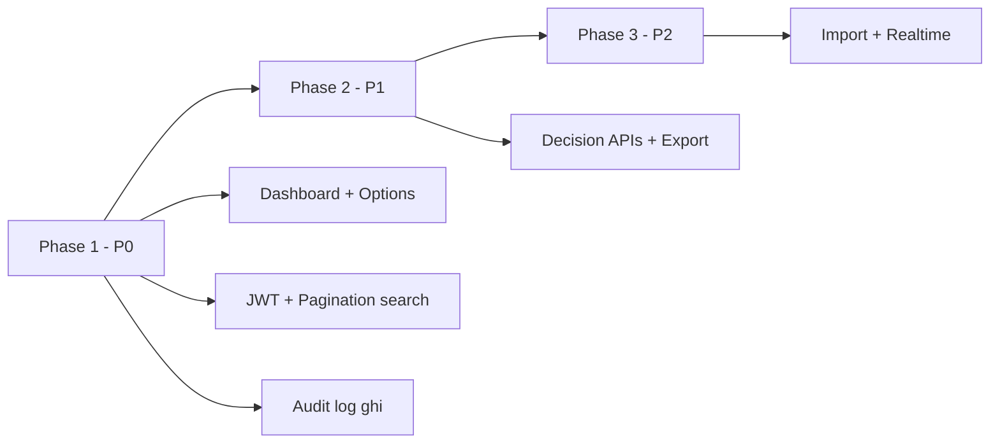

@# Hướng dẫn triển khai Admin HRM Metal — Developer Guide

Tài liệu này tổng hợp **yêu cầu thực hiện cụ thể** cho developer Backend và Frontend, dựa trên:

| Nguồn | Đường dẫn |
|-------|-----------|
| Spec API từ code BE | `docs/ADMIN_FRONTEND_SPEC.md` |
| Backlog PM/PO | `docs/BACKEND_ADMIN_REQUIREMENTS.md` |
| Yêu cầu từ FE Admin | `~/Desktop/hrm-admin-page/docs/BE_API_REQUIREMENTS.md` |
| Checklist đồng bộ API | `~/Desktop/hrm-admin-page/docs/admin-api-checklist.md` |

**Mục tiêu:** Developer đọc một file, biết **làm gì**, **ở đâu**, **thứ tự**, **tiêu chí hoàn thành**.

### Mục lục nhanh

| Ai đọc | Bắt đầu từ |
|--------|------------|
| **Dev junior mới** | [PHẦN A — A.1](#a1-chuẩn-bị-môi-trường-lần-đầu) → A.4 (B3) → A.5 (JWT) |
| **Backend** | §1 Quy ước → §3 Tasks P0 → PHẦN A mẫu code |
| **Frontend** | [A.9 Hướng dẫn Frontend Junior](#a9-hướng-dẫn-frontend-junior) → FE-01, FE-02 |
| **Tech lead** | §2 Roadmap → §10 Sprint → §14 Tóm tắt |

---

## 0. Tổng quan dự án

### 0.1 Hai repository

| Repo | Đường dẫn | Stack | Vai trò |
|------|-----------|-------|---------|
| **hrmMetal** | `~/Desktop/hrmMetal` | Express + TypeScript, Sequelize/PostgreSQL, Swagger, Cloudinary, Redis, Socket.IO | Backend API |
| **hrm-admin-page** | `~/Desktop/hrm-admin-page` | React 18 + Vite + CoreUI + Redux | Trang Admin web |

### 0.2 Base URL & Swagger

```txt
Base API:  /api/version/v1
Swagger:   http://localhost:4000/api-docs
JSON:      http://localhost:4000/docs.json
```

Router gốc BE: `src/routers/v1/v1.ts` — **path module viết thường** (`planproduction`, `overtimerequest`, `safetyreport`, …).

### 0.3 Trạng thái hiện tại (đã đối chiếu code)

| Hạng mục | Trạng thái |
|----------|------------|
| API nghiệp vụ cơ bản (users, checkin, paid leave, OT, payroll, …) | ✅ Có, FE Admin đang gọi |
| Prefix `/admin/*` (dashboard, options, search chuẩn) | ❌ **Chưa có** trong `v1.ts` |
| `GET /admin/dashboard/summary` | ❌ FE gọi → 404, **fallback** 4–5 API trong `Dashboard.js` |
| Middleware `authAdminRole` | ⚠️ Đọc `user_id` từ **body**, chỉ cho role `ADMIN` |
| JWT middleware cho admin | ⚠️ Chưa thống nhất; một số route dùng body `user_id` |
| Pagination chuẩn `page/limit` | ❌ Hầu hết search trả full list |
| Audit log | ❌ Chưa có model/bảng |
| FE sync API từ Swagger | ✅ `npm run sync:api` → `generatedApiPaths.js` |
| Module generic CRUD Admin | ✅ `AdminModulePage.jsx` + `moduleConfig.js` |
| Menu placeholder (assets, contracts, purchases, …) | ⚠️ Có route FE, **không có API BE** |

---

## 1. Quy ước bắt buộc (BE + FE)

### 1.1 Response API

**Thành công:**

```json
{ "success": true, "data": {}, "message": "optional" }
```

**Lỗi:**

```json
{
  "success": false,
  "message": "Mô tả lỗi",
  "code": "VALIDATION_ERROR",
  "details": {}
}
```

| Quy tắc | Chi tiết |
|---------|----------|
| FE | Luôn kiểm tra `success === false`, kể cả HTTP `200` |
| BE mới | Lỗi validation → `400`; forbidden → `403`; not found → `404` |
| BE cũ | Giữ tương thích; route mới tuân thủ HTTP status đúng |

### 1.2 Authentication

```http
Authorization: Bearer <JWT>
```

- Login: `POST /login` → `{ data: user, token }`.
- **Yêu cầu mới:** User thực hiện action lấy từ JWT (`req.user`), **không** bắt `user_id` admin trong body.
- **Hiện tại:** `authAdminRole` tại `src/middlewares/veryRoleAdmin.middleware.ts` vẫn đọc `req.body.user_id` — cần refactor (xem Task **INFRA-01**).

### 1.3 Pagination (API admin mới)

**Request:**

```json
{
  "page": 1,
  "limit": 20,
  "sort_by": "created_at",
  "sort_order": "desc",
  "filters": {}
}
```

**Response:**

```json
{
  "success": true,
  "data": {
    "items": [],
    "pagination": { "page": 1, "limit": 20, "total": 100, "total_pages": 5 }
  }
}
```

### 1.4 Ngày giờ

- Format: `yyyy-MM-dd` (ISO date).
- Timezone tổng hợp dashboard: **`Asia/Tokyo` (+09:00)**.

### 1.5 Cấu trúc code Backend (khi thêm tính năng)

Tạo theo layer hiện có:

```txt
src/routers/admin/          → router mount vào v1
src/controllers/admin/      → xử lý request/response
src/useCases/admin/         → business logic
src/repositorys/            → truy vấn DB (hoặc mở rộng repo có sẵn)
src/validates/admin/        → Joi validation
src/swagger/swaggerAPI/admin/
```

Mount trong `src/routers/v1/v1.ts`:

```ts
import adminRouter from '../admin/admin.router';
v1Router.use('/admin', adminRouter);
```

**Không xóa route cũ** — route mới song song, ghi Swagger, deprecate dần.

### 1.6 Cấu trúc code Frontend

| File / thư mục | Mục đích |
|----------------|----------|
| `src/api/apiClient.js` | HTTP client, xử lý `success` |
| `src/api/adminClient.js` | `adminRequest`, `withAdminUser` |
| `src/constants.js` | Path aliases (sau `sync:api`) |
| `src/constants/adminOptions.js` | Enum hard-code — **thay bằng API** (Task FE-02) |
| `src/views/admin/moduleConfig.js` | CRUD generic theo module |
| `src/views/dashboard/Dashboard.js` | Dashboard + fallback summary |

**Sau khi BE đổi API:** chạy `npm run sync:api` (hrmMetal port 4000).

---

## PHẦN A — Hướng dẫn cho Dev Junior (đọc trước khi code)

Phần này giải thích **cách project chạy**, **thứ tự tạo file**, và **cách tự kiểm tra**. Nếu bạn mới vào team, làm lần lượt từ **A.1 → A.5**, sau đó mới nhận task INFRA-01 / B3 / A1.

### A.1 Chuẩn bị môi trường (lần đầu)

#### Backend (`hrmMetal`)

```bash
cd ~/Desktop/hrmMetal
cp .env.example .env    # nếu chưa có .env — hỏi team lead lấy SECRET, DB_*
npm install
npm run dev
```

**Kiểm tra thành công:**

- Terminal không lỗi kết nối PostgreSQL.
- Mở trình duyệt: `http://localhost:4000/api-docs` — thấy Swagger.
- Mở `http://localhost:4000/docs.json` — thấy JSON (FE dùng file này để sync).

#### Frontend (`hrm-admin-page`)

```bash
cd ~/Desktop/hrm-admin-page
cp .env.example .env
# VITE_API_URL hoặc VITE_API_BASE_URL trỏ tới http://localhost:4000/api/version/v1
npm install
npm run dev
```

**Kiểm tra:** đăng nhập được bằng tài khoản admin test (hỏi team nếu chưa có).

#### Công cụ nên cài

| Công cụ | Dùng để |
|---------|---------|
| Postman hoặc Insomnia | Gọi API thử nhanh hơn Swagger |
| VS Code / Cursor | IDE |
| Extension REST Client (tùy chọn) | Gọi API từ file `.http` |

---

### A.2 Request đi qua project như thế nào?

Hiểu luồng này trước khi thêm API — **đừng viết logic DB trực tiếp trong router**.

```txt
Client (FE / Postman)
    → Express Router          (src/routers/...)
        → Controller          (src/controllers/...)     — nhận req, gọi use case, trả res
            → Use Case        (src/useCases/...)        — nghiệp vụ, validate
                → Repository  (src/repositorys/...)   — Sequelize query DB
                    → Model   (src/models/...)
```

**Ví dụ có sẵn để bắt chước:**

| Loại | File mẫu |
|------|----------|
| Router đơn giản | `src/routers/department/getAll/getall.router.ts` |
| Router + search body | `src/routers/paidLeaveReqest/search/searchPaidLeaveRequestWithField.router.ts` |
| Login + JWT | `src/repositorys/login/login.repository.ts` (dòng `jwt.sign`) |
| Middleware token (tham khảo) | `src/middlewares/veryTokenOrder.middleware.ts` |
| Trả response chuẩn | `src/helpers/responeHandle/successRespone.ts`, `errorRespone.ts` |

**Quy tắc nhớ:**

- Router: chỉ `try/catch`, gọi controller, `successResponse` / `errorResponse`.
- Use case: trả `{ success: true, data }` hoặc `{ success: false, message }`.
- **Không** trả `password` trong bất kỳ list/search nào (`attributes: { exclude: ['password'] }`).

---

### A.3 Tạo module `/admin` lần đầu (skeleton)

Làm **một lần** trước khi thêm A1, B1, B3…

#### Bước 1 — Tạo router gốc admin

**Tạo file:** `src/routers/admin/admin.router.ts`

```typescript
import { Router } from 'express';
import optionsRouter from './options/options.router';
import dashboardRouter from './dashboard/dashboard.router';
// import thêm router con khi làm xong từng task

const adminRouter = Router();

// TODO: gắn middleware JWT cho toàn bộ admin (sau INFRA-01)
// adminRouter.use(authJwt);

adminRouter.use('/options', optionsRouter);
adminRouter.use('/dashboard', dashboardRouter);

export default adminRouter;
```

#### Bước 2 — Mount vào v1

**Sửa file:** `src/routers/v1/v1.ts`

```typescript
import adminRouter from '../admin/admin.router';
// ...
v1Router.use('/admin', adminRouter);
```

#### Bước 3 — Kiểm tra

```bash
npm run dev
curl http://localhost:4000/api/version/v1/admin/options/enums
# Trước khi code xong sẽ 404 — sau B3 phải trả JSON success
```

#### Cấu trúc thư mục gợi ý (mở rộng dần)

```txt
src/routers/admin/
  admin.router.ts
  dashboard/
    dashboard.router.ts
    getSummary.router.ts
  options/
    options.router.ts
    getEnums.router.ts
    getDepartments.router.ts
    getUsers.router.ts
  paidLeaves/
    paidLeaves.router.ts
    searchPaidLeaves.router.ts
```

Mỗi endpoint = **1 file router nhỏ** (giống `department/getAll/getall.router.ts`), không nhồi hết vào 1 file 500 dòng.

---

### A.4 Mẫu code: 1 endpoint GET hoàn chỉnh (task B3 — enums)

Đây là task **dễ nhất** cho junior — làm B3 trước để quen flow.

#### Bước 1 — Router

**Tạo:** `src/routers/admin/options/getEnums.router.ts`

```typescript
import { Request, Response, Router } from 'express';
import { getAdminEnumsController } from '../../../controllers/admin/options/getAdminEnums.controller';
import { errorResponse, successResponse } from '../../../helpers';

const getEnumsRouter = Router();

getEnumsRouter.get('/', async (req: Request, res: Response) => {
    try {
        const result = await getAdminEnumsController();
        if (!result?.success) {
            return errorResponse(res, 400, result?.message || 'Failed');
        }
        return successResponse(res, 200, result.data);
    } catch (error: any) {
        return errorResponse(res, 500, error?.message || 'Internal server error');
    }
});

export default getEnumsRouter;
```

**Tạo:** `src/routers/admin/options/options.router.ts`

```typescript
import { Router } from 'express';
import getEnumsRouter from './getEnums.router';

const optionsRouter = Router();
optionsRouter.use('/enums', getEnumsRouter);

export default optionsRouter;
```

#### Bước 2 — Controller

**Tạo:** `src/controllers/admin/options/getAdminEnums.controller.ts`

```typescript
import { getAdminEnumsUseCase } from '../../../useCases/admin/options/getAdminEnums.useCase';

export const getAdminEnumsController = async () => {
    return getAdminEnumsUseCase();
};
```

#### Bước 3 — Use case (đọc enum từ `src/enum`)

**Tạo:** `src/useCases/admin/options/getAdminEnums.useCase.ts`

```typescript
import {
    Role,
    Position,
    Products,
    shift_work,
    shift,
    notification_type,
    UniformType,
    UniformSize,
    TaxDependentStatusEnum,
} from '../../../enum';

/** Chuyển enum TypeScript → mảng string cho FE */
const enumToArray = (enumObj: object): string[] =>
    Object.values(enumObj).filter((v) => typeof v === 'string') as string[];

export const getAdminEnumsUseCase = async () => {
    try {
        const data = {
            roles: enumToArray(Role),
            positions: enumToArray(Position),
            products: enumToArray(Products),
            work_shifts: enumToArray(shift_work),
            shifts: enumToArray(shift),
            notification_types: enumToArray(notification_type),
            uniform_types: enumToArray(UniformType),
            uniform_sizes: enumToArray(UniformSize),
            tax_dependent_statuses: enumToArray(TaxDependentStatusEnum),
        };
        return { success: true, data };
    } catch (error: any) {
        return { success: false, message: error?.message };
    }
};
```

> **Lưu ý:** Mở `src/enum/Role.enum.ts` — nếu enum kiểu `Role { STAFF = 'STAFF' }` thì `enumToArray` hoạt động. Nếu team dùng kiểu khác, hỏi senior hoặc copy cách `isValidEnumValue` trong helpers.

#### Bước 4 — Export controller (nếu project dùng barrel)

Thêm export vào `src/controllers/index.ts` và `src/useCases/index.ts` **nếu** các router khác import từ đó. Hoặc import trực tiếp như mẫu trên (cả hai đều được — **theo convention file bạn đang sửa**).

#### Bước 5 — Swagger (bắt buộc trước khi báo xong)

**Tạo hoặc sửa:** `src/swagger/swaggerAPI/admin/options.swagger.ts`

- Copy format từ `src/swagger/swaggerAPI/department/department.swagger.ts`.
- Path phải là: `/api/version/v1/admin/options/enums`.
- Method: `GET`.

#### Bước 6 — Tự test

```bash
# 1. Login lấy token (thay user/pass)
curl -s -X POST http://localhost:4000/api/version/v1/login \
  -H "Content-Type: application/json" \
  -d '{"user_name":"admin","password":"your_password"}' | jq .

# 2. Gọi enums (khi đã gắn JWT thì thêm -H Authorization)
curl -s http://localhost:4000/api/version/v1/admin/options/enums | jq .
```

**Pass khi:** `success: true`, có mảng `roles`, `positions`, …

#### Bước 7 — Báo FE sync

```bash
cd ~/Desktop/hrm-admin-page && npm run sync:api
```

---

### A.5 Mẫu code: JWT middleware (task INFRA-01)

Project **đã có** cách sign/verify JWT trong login. Junior **copy cùng secret**, không tự đặt secret mới.

**Tham khảo sign token:** `src/repositorys/login/login.repository.ts` (dòng 78–85).

**Tạo:** `src/middlewares/authJwt.middleware.ts`

```typescript
import { Request, Response, NextFunction } from 'express';
import jwt from 'jsonwebtoken';
import crypto from 'crypto';
import dotenv from 'dotenv';

dotenv.config();

const SECRET: string = process.env.SECRET || 'secret';

/** Mở rộng Express Request — TypeScript */
declare global {
    namespace Express {
        interface Request {
            user?: {
                id: string;
                role: string;
                position?: string;
                department_id?: string;
                [key: string]: unknown;
            };
        }
    }
}

export const authJwt = (
    req: Request,
    res: Response,
    next: NextFunction,
): void => {
    const token = req.headers.authorization?.split(' ')[1];
    if (!token) {
        res.status(401).json({ success: false, message: 'Token required' });
        return;
    }

    const secret = crypto.createHash('sha256').update(SECRET).digest('hex');

    jwt.verify(token, secret, (err, decoded) => {
        if (err || !decoded || typeof decoded !== 'object') {
            res.status(401).json({ success: false, message: 'Invalid or expired token' });
            return;
        }
        const payload = decoded as { id: string; role: string };
        req.user = payload;
        next();
    });
};
```

**Tạo:** `src/middlewares/requireRoles.middleware.ts`

```typescript
import { Request, Response, NextFunction } from 'express';

export const requireRoles =
    (allowedRoles: string[]) =>
    (req: Request, res: Response, next: NextFunction): void => {
        const role = req.user?.role?.toString();
        if (!role || !allowedRoles.includes(role)) {
            res.status(403).json({
                success: false,
                message: 'You do not have permission for this action',
            });
            return;
        }
        next();
    };
```

**Export trong** `src/middlewares/index.ts`:

```typescript
export { authJwt } from './authJwt.middleware';
export { requireRoles } from './requireRoles.middleware';
```

**Gắn vào admin router:**

```typescript
import { authJwt, requireRoles } from '../../middlewares';

adminRouter.use(authJwt);
adminRouter.use(requireRoles(['ADMIN', 'MANAGER'])); // điều chỉnh theo task
```

**Tương thích app cũ (Option B):** sửa `veryRoleAdmin.middleware.ts`:

```typescript
// Ưu tiên JWT nếu đã có req.user
const actorId = req.user?.id ?? req.body?.user_id;
```

**Test INFRA-01:**

| Case | Cách gọi | Kỳ vọng |
|------|----------|---------|
| Không token | GET `/admin/options/enums` | `401` |
| Token sai | Header `Bearer abc` | `401` |
| Token đúng, role STAFF | Bearer token staff | `403` (nếu route cần ADMIN) |
| Token admin | Bearer token admin | `200` + data |

---

### A.6 Mẫu code: Pagination search (task C3 — paid leave)

Áp dụng **cùng pattern** cho C1, C2, C4, C5, C6 — chỉ đổi model và filter.

#### Bước 1 — Validate body (Joi)

**Tạo:** `src/validates/admin/paidLeaveSearch.validate.ts`

```typescript
import Joi from '@hapi/joi';

export const validateAdminPaidLeaveSearch = (body: unknown) => {
    const schema = Joi.object({
        page: Joi.number().integer().min(1).default(1),
        limit: Joi.number().integer().min(1).max(100).default(20),
        sort_by: Joi.string().default('created_at'),
        sort_order: Joi.string().valid('asc', 'desc').default('desc'),
        filters: Joi.object({
            user_id: Joi.string().uuid().optional(),
            department_id: Joi.string().uuid().optional(),
            position: Joi.string().optional(),
            is_confirm: Joi.boolean().optional(),
            is_approve: Joi.boolean().optional(),
            date_from: Joi.string().optional(),
            date_to: Joi.string().optional(),
        }).default({}),
    });
    return schema.validate(body);
};
```

#### Bước 2 — Repository

**Tạo hoặc mở rộng** repository paid leave — dùng `findAndCountAll`:

```typescript
import { Op } from 'sequelize';
import { PaidLeaveRequest, User } from '../../models';

export const searchPaidLeavesAdmin = async (params: {
    page: number;
    limit: number;
    sort_by: string;
    sort_order: 'asc' | 'desc';
    filters: Record<string, unknown>;
}) => {
    const { page, limit, sort_by, sort_order, filters } = params;
    const offset = (page - 1) * limit;
    const where: Record<string, unknown> = {};

    if (filters.is_confirm !== undefined) where.is_confirm = filters.is_confirm;
    if (filters.is_approve !== undefined) where.is_approve = filters.is_approve;
    if (filters.position) where.position = filters.position;
    // date_from / date_to: where.date_leave = { [Op.between]: [...] }

    const { rows, count } = await PaidLeaveRequest.findAndCountAll({
        where,
        limit,
        offset,
        order: [[sort_by, sort_order.toUpperCase()]],
        include: [
            { model: User, as: 'user', attributes: { exclude: ['password'] } },
            // leader nếu model có association
        ],
    });

    const items = rows.map((row) => {
        const plain = row.get({ plain: true });
        let status = 'PENDING_LEADER';
        if (plain.is_approve) status = 'APPROVED';
        else if (plain.is_confirm) status = 'PENDING_ADMIN';
        return { ...plain, status };
    });

    return {
        items,
        pagination: {
            page,
            limit,
            total: count,
            total_pages: Math.ceil(count / limit) || 1,
        },
    };
};
```

> **Tip:** Mở `src/models/paidLeaveRequest.model.ts` xem tên association (`as: 'user'`) — phải khớp, nếu không Sequelize báo lỗi include.

#### Bước 3 — Router

`POST /admin/paid-leaves/search` — mount trong `paidLeaves.router.ts`.

Body mẫu test:

```json
{
  "page": 1,
  "limit": 10,
  "sort_by": "created_at",
  "sort_order": "desc",
  "filters": { "is_confirm": false }
}
```

**Pass khi:**

- `items.length <= limit`
- `pagination.total` khớp số bản ghi DB
- Page 2 khác page 1

---

### A.7 Mẫu code: Dashboard summary (task A1)

#### Logic đếm — dùng `Promise.all`

Trong use case, **không** gọi tuần tự 10 query nếu có thể song song:

```typescript
import moment from 'moment-timezone';

const TZ = 'Asia/Tokyo';
const today = moment().tz(TZ).format('YYYY-MM-DD');

const [
    employeeTotal,
    employeeActive,
    pendingPaidLeave,
    // ...
] = await Promise.all([
    User.count(),
    User.count({ where: { is_active: true } }),
    PaidLeaveRequest.count({
        where: { is_approve: false }, // tinh chỉnh theo spec
    }),
    // Order.count({ where: { date: today } }),
]);
```

**Router:** `GET /admin/dashboard/summary` — query `?position=HINO&date=2026-05-26`.

**Sau khi xong:** mở `hrm-admin-page/src/views/dashboard/Dashboard.js`:

- Hàm `getAdminSummary` đã gọi đúng path — chỉ cần BE trả 200.
- Trong `catch` vẫn còn fallback — **xóa fallback** khi QA xác nhận số liệu khớp.

---

### A.8 Mẫu code: Audit log (task F1)

Project **chưa có** thư mục `migrations/` — hỏi team cách tạo bảng:

- **Cách 1:** SQL script chạy tay trên PostgreSQL (team cung cấp template).
- **Cách 2:** Sequelize CLI sync (nếu team cho phép).

#### Model

**Tạo:** `src/models/auditLog.model.ts` — các cột như mục F1.

#### Helper ghi log

**Tạo:** `src/helpers/auditLog/writeAuditLog.ts`

```typescript
import { AuditLog } from '../../models/auditLog.model';
import { Request } from 'express';

export const writeAuditLog = async (input: {
    actorUserId: string;
    action: string;
    resourceType: string;
    resourceId: string;
    beforeData?: object;
    afterData?: object;
    req?: Request;
}) => {
    try {
        await AuditLog.create({
            actor_user_id: input.actorUserId,
            action: input.action,
            resource_type: input.resourceType,
            resource_id: input.resourceId,
            before_data: input.beforeData ?? null,
            after_data: input.afterData ?? null,
            ip_address: input.req?.ip,
            user_agent: input.req?.get('user-agent'),
        });
    } catch (e) {
        console.error('audit log failed', e);
        // Không throw — không làm hỏng API chính vì log lỗi
    }
};
```

#### Gắn vào use case duyệt nghỉ phép (ví dụ)

Trước khi `update`, `const before = await PaidLeaveRequest.findByPk(id)`; sau update gọi `writeAuditLog({ action: 'PAID_LEAVE_APPROVE', ... })`.

---

### A.9 Hướng dẫn Frontend Junior

#### Gọi API đúng cách

Luôn ưu tiên `adminRequest` (đã gắn token + bắt `success: false`):

```javascript
import { adminRequest } from "../../api/adminClient";

const data = await adminRequest({
  method: "get",
  path: "/admin/options/enums",
});
```

**Route cũ cần `user_id` admin trong body** — dùng `withAdminUser`:

```javascript
import { adminRequest, withAdminUser } from "../../api/adminClient";

await adminRequest({
  method: "post",
  path: "/overtimerequest/getAll",
  data: withAdminUser({}),  // tự thêm user_id từ session
});
```

#### Load enums sau login (task FE-02)

**Tạo:** `src/store/enumStore.js` hoặc Redux slice đơn giản:

```javascript
// Pseudocode — chọn đúng pattern project (store.js đang dùng Redux)
export const loadEnums = async (dispatch) => {
  const enums = await adminRequest({ method: "get", path: "/admin/options/enums" });
  dispatch({ type: "SET_ENUMS", payload: enums });
};
```

Gọi trong `Login.js` sau khi login thành công, hoặc trong `DefaultLayout.js` lần đầu vào admin.

**Sửa `moduleConfig.js`:** thay `POSITION_OPTIONS` import tĩnh bằng `enums.positions` từ store.

#### Component chọn user (sau B1)

**Tạo:** `src/components/UserSelect.jsx`

```javascript
import { useState, useEffect } from "react";
import { adminRequest } from "../api/adminClient";

export default function UserSelect({ value, onChange, label = "Nhân viên" }) {
  const [options, setOptions] = useState([]);
  const [keyword, setKeyword] = useState("");

  useEffect(() => {
    const t = setTimeout(async () => {
      try {
        const list = await adminRequest({
          method: "get",
          path: "/admin/options/users",
          params: { keyword, limit: 50 },
        });
        setOptions(Array.isArray(list) ? list : []);
      } catch {
        setOptions([]);
      }
    }, 300);
    return () => clearTimeout(t);
  }, [keyword]);

  return (
    <div>
      <label>{label}</label>
      <input
        placeholder="Tìm tên / mã NV..."
        onChange={(e) => setKeyword(e.target.value)}
      />
      <select value={value || ""} onChange={(e) => onChange(e.target.value)}>
        <option value="">-- Chọn --</option>
        {options.map((u) => (
          <option key={u.id} value={u.id}>
            {u.employee_id} - {u.name}
          </option>
        ))}
      </select>
    </div>
  );
}
```

Trong form `AdminModulePage`, nếu field `type: 'user_select'` thì render `UserSelect` (cần mở rộng `AdminModulePage.jsx` — làm từng bước nhỏ, test 1 module `paidLeave` trước).

#### Pagination phía FE (sau C3)

Trong `moduleConfig` thêm:

```javascript
paidLeave: {
  // ...
  serverPagination: true,
  search: { path: "/admin/paid-leaves/search" },
}
```

Trong `AdminModulePage.jsx` — khi `serverPagination`:

- State: `page`, `limit`, `total`.
- Gọi search với body `{ page, limit, filters: {...} }`.
- Hiển thị nút Prev/Next; `items` lấy từ `data.items`.

> **Gợi ý:** Tìm trong file chỗ `loadData` / `fetchList` — sửa **một nhánh** `if (config.serverPagination)` trước, đừng refactor toàn bộ trang một lúc.

#### Sync API sau khi BE đổi Swagger

```bash
# Terminal 1
cd ~/Desktop/hrmMetal && npm run dev

# Terminal 2
cd ~/Desktop/hrm-admin-page && npm run sync:api
```

Nếu lỗi `ECONNREFUSED` — BE chưa chạy hoặc sai port.

---

### A.10 Checklist trước khi tạo Pull Request

**Backend**

- [ ] `npm run build` (TypeScript compile) không lỗi
- [ ] Test tay trên Swagger hoặc curl **ít nhất 3 case**: success, thiếu quyền, validation sai
- [ ] Swagger path **khớp** `v1.ts` (chữ thường, đúng prefix `/admin`)
- [ ] Không commit `.env`, password
- [ ] Không xóa route cũ (chỉ thêm mới)

**Frontend**

- [ ] `npm run build` pass
- [ ] Login → màn hình liên quan không crash
- [ ] Console browser không lỗi 404 path sai

**Mô tả PR (copy template)**

```markdown
## Task
INFRA-01 / B3 / A1 / ...

## Thay đổi
- Thêm GET /admin/options/enums
- ...

## Cách test
1. npm run dev (hrmMetal)
2. Login → copy token
3. curl ...

## Ảnh / screenshot
(dán Swagger hoặc màn FE)
```

---

### A.11 Lỗi thường gặp & cách xử lý

| Triệu chứng | Nguyên nhân thường gặp | Cách xử lý |
|-------------|------------------------|------------|
| `401 authentication failed` | Thiếu header `Authorization: Bearer <token>` | Login lại, copy token đúng |
| `403 not admin` | `authAdminRole` / `requireRoles` chặn | Dùng user role ADMIN; hoặc mở role trong middleware |
| `success: false` HTTP 200 | Pattern cũ của BE | FE vẫn phải check `success`; BE mới nên trả 400/403 |
| Sequelize `EagerLoadingError` | Sai tên `as` trong `include` | Mở model `associate()` |
| Swagger có path nhưng 404 | Chưa mount router vào `v1.ts` | Kiểm tra `admin.router` → `v1Router.use` |
| `sync:api` không cập nhật path | BE không chạy / cache | Restart BE, xóa `swagger-output.json` nếu cần |
| Dashboard vẫn chậm | FE vẫn chạy fallback nhiều API | BE bật A1; FE xóa block fallback trong `catch` |
| Enum trống `[]` | `enumToArray` không khớp kiểu enum | Log `Object.values(Role)` trong use case |

---

### A.12 Thứ tự task gợi ý cho Junior mới

| Tuần | Task | Lý do |
|------|------|-------|
| 1 | Đọc A.1–A.2, chạy được BE + FE | Nền tảng |
| 1 | **B3** (enums) theo A.4 | Dễ, học đủ layer |
| 2 | **INFRA-01** theo A.5 | Dùng cho mọi API sau |
| 2 | **B2** (departments options) | Copy B3, đổi query `Department.findAll` |
| 3 | **B1** (users options) | Thêm `keyword` search |
| 3–4 | **C3** (paid leave search) theo A.6 | Pagination + status |
| 4 | **A1** (dashboard summary) theo A.7 | Ghép FE Dashboard |

Sau khi làm xong 6 task trên, junior đủ tự làm C1, C4, C5 với cùng pattern.

---

## 2. Roadmap theo phase



| Phase | Ưu tiên | Mục tiêu | Thời lượng gợi ý |
|-------|---------|-----------|------------------|
| **Phase 1** | P0 | Admin chạy end-to-end ổn định | 2–3 sprint |
| **Phase 2** | P1 | Vận hành tốt (duyệt thống nhất, export) | 1–2 sprint |
| **Phase 3** | P2 | Nâng cao (import, realtime, report builder) | backlog |

---

## 3. Phase 1 — Tasks chi tiết (P0)

### INFRA-01 — JWT middleware + role guard thay `user_id` body

| | |
|---|---|
| **Owner** | Backend |
| **Priority** | P0 — làm **trước** các API admin mới |
| **Phụ thuộc** | Không |
| **Hướng dẫn chi tiết** | **PHẦN A — A.5** (code mẫu + bảng test) |

**Hiện trạng:** `veryRoleAdmin.middleware.ts` chỉ check `req.body.user_id` và role `ADMIN`.

**Việc cần làm:**

1. Tạo `src/middlewares/authJwt.middleware.ts`:
   - Đọc `Authorization: Bearer <token>`.
   - Verify JWT (dùng logic/login hiện có).
   - Gắn `req.user = { id, role, position, department_id, ... }`.
2. Tạo `src/middlewares/requireRoles.middleware.ts`:
   - `requireRoles(['ADMIN', 'MANAGER'])` — configurable.
3. Refactor `authAdminRole`:
   - Option A (khuyến nghị): deprecated, thay bằng `authJwt` + `requireRoles(['ADMIN'])`.
   - Option B: `authAdminRole` đọc `req.user` nếu có JWT, fallback `body.user_id` (tương thích app mobile cũ).
4. Áp dụng cho **route admin mới** dưới `/admin/*`.
5. Cập nhật Swagger: security scheme `bearerAuth`.

**Acceptance criteria:**

- [ ] Gọi API admin mới không cần `user_id` trong body.
- [ ] Token hết hạn / sai → `401`.
- [ ] Role không đủ → `403`.
- [ ] Route cũ (`dayoffs/create`, `overtimerequest/getAll`, …) vẫn hoạt động (tương thích).

**Files tham chiếu:**

- `src/middlewares/veryRoleAdmin.middleware.ts`
- `src/routers/dayOff/dayOff.router.ts`
- `src/routers/overtimeRequest/overtimeRequest.router.ts`

---

### A1 — Dashboard summary

| | |
|---|---|
| **Task ID** | A1 |
| **Owner** | Backend (+ FE tích hợp) |
| **Endpoint** | `GET /api/version/v1/admin/dashboard/summary` |
| **Phụ thuộc** | INFRA-01 |
| **Hướng dẫn chi tiết** | **PHẦN A — A.7** |

**Query (optional):** `department_id`, `position`, `date` (default: hôm nay +09:00).

**Response `data`:**

```json
{
  "employee_total": 120,
  "employee_active": 110,
  "pending_paid_leave": 5,
  "pending_overtime_leader": 3,
  "pending_overtime_admin": 2,
  "pending_safety_report": 4,
  "today_orders": 80,
  "today_production": 12,
  "today_checkins": 95,
  "today_present": 90,
  "today_on_leave": 8,
  "today_absent": 10,
  "attendance_rate": 94.5,
  "inventory_low_count": 3
}
```

**Logic gợi ý (repository/use case):**

| Field | Nguồn dữ liệu hiện có |
|-------|----------------------|
| `employee_*` | `users` — `is_active` |
| `pending_paid_leave` | `paidLeave` — `is_confirm=false` hoặc `is_approve=false` |
| `pending_overtime_*` | `overtimeRequest` — tách leader/admin theo `is_confirm`, `is_approved` |
| `pending_safety_report` | `safetyReport` — `is_confirm=false` |
| `today_orders` | `order` theo `date` + filter position |
| `today_checkins` / present / leave | `checkin` theo `date` |
| `today_production` | `planproduction` hoặc `dailyreport` theo ngày |
| `inventory_low_count` | `inventory` — ngưỡng quantity (định nghĩa với PM) |

**Quyền:** `ADMIN`, `MANAGER` (filter theo department nếu không phải ADMIN).

**Performance:** Một request, target &lt; 1s — dùng `Promise.all` + query có index (`date`, `department_id`, `position`, flags).

**FE (hrm-admin-page):**

- File: `src/views/dashboard/Dashboard.js` — đã gọi `GET /admin/dashboard/summary`; khi BE xong, **xóa hoặc giảm** block fallback (dòng ~178+).
- Verify mapping field với `StatsCards`, `SecondaryStats`.

**Acceptance criteria:**

- [ ] Swagger có endpoint, security bearer.
- [ ] Response &lt; 1s với data production.
- [ ] FE dashboard không cần 4–5 request fallback.
- [ ] Timezone +09:00 cho “hôm nay”.

---

### A2 — Dashboard charts

| | |
|---|---|
| **Task ID** | A2 |
| **Owner** | Backend + FE |
| **Endpoint** | `POST /api/version/v1/admin/dashboard/charts` |
| **Phụ thuộc** | INFRA-01 |

**Body:**

```json
{
  "start_date": "2026-05-01",
  "end_date": "2026-05-31",
  "department_id": "uuid",
  "position": "HINO"
}
```

**Response `data` (tối thiểu):**

```json
{
  "attendance_by_day": [{ "date": "2026-05-26", "present": 90, "leave": 5, "absent": 10, "late": 3 }],
  "production_by_day": [{ "date": "2026-05-26", "quantity": 1000, "good": 950, "defective": 50 }],
  "shift_distribution": [{ "label": "DAY", "count": 8 }, { "label": "NIGHT", "count": 4 }],
  "pending_by_type": { "paid_leave": 5, "overtime": 5, "safety_report": 4 }
}
```

**FE:**

- `src/views/dashboard/components/AttendanceChart.jsx` — chuyển từ aggregate client sang API này khi có.
- `ShiftOverview.jsx` — dùng `shift_distribution`.

**Acceptance criteria:**

- [ ] `start_date`, `end_date` bắt buộc; filter khác optional.
- [ ] Chart.js/CoreUI render trực tiếp không cần transform phức tạp.

---

### B1 — User options (select)

| | |
|---|---|
| **Task ID** | B1 |
| **Endpoint** | `GET /admin/options/users` |
| **Query** | `keyword`, `department_id`, `position`, `role`, `is_active`, `limit` (default 50) |

**Response item:**

```json
{
  "id": "uuid",
  "employee_id": 1001,
  "name": "Nguyen Van A",
  "user_name": "nva",
  "department_id": "uuid",
  "department_name": "Production",
  "position": "HINO",
  "role": "STAFF"
}
```

**FE:**

- Thay input text `user_id` / `leader_id` trong `moduleConfig.js` (paidLeave, overtime, …) bằng **AsyncSelect** gọi B1.
- Tạo hook `useUserOptions(keyword)`.

**Acceptance criteria:**

- [ ] Search keyword: name, user_name, employee_id.
- [ ] Không trả password/hash.

---

### B2 — Department options

| | |
|---|---|
| **Task ID** | B2 |
| **Endpoint** | `GET /admin/options/departments` |
| **Response** | `[{ "id", "name" }]` |

**FE:** Filter phòng ban, form department — thay `GET /department/getall` + map thủ công nếu cần.

---

### B3 — System enums

| | |
|---|---|
| **Task ID** | B3 |
| **Endpoint** | `GET /admin/options/enums` |
| **Nguồn** | `src/enum/*` — **không hard-code trong controller** |
| **Hướng dẫn chi tiết** | **PHẦN A — A.4** (làm task đầu tiên cho junior) |

**Response gồm:** `roles`, `positions`, `products`, `work_shifts`, `shifts`, `notification_types`, `uniform_types`, `uniform_sizes`, `tax_dependent_statuses`, …

**FE Task FE-02:**

1. Load enums một lần khi app init (sau login).
2. Lưu Redux/context.
3. Xóa dần `adminOptions.js` hard-code; `moduleConfig.js` dùng options động.

**Acceptance criteria:**

- [ ] Một request khi load admin.
- [ ] Thêm enum BE → FE tự có option mới.

---

### C1–C6 — Admin search có pagination

> **Junior:** làm mẫu **C3** trước theo **PHẦN A — A.6**, sau đó copy đổi model cho C1, C2, C4, C5, C6.

Áp dụng chung pattern cho:

| Task | Endpoint | Thay thế / bổ sung |
|------|----------|-------------------|
| C1 | `POST /admin/users/search` | `GET /users`, `POST /users/finduserwithfield` |
| C2 | `POST /admin/checkins/search` | `POST /checkin/search`, `getcheckinindateofposition` |
| C3 | `POST /admin/paid-leaves/search` | `POST /paidleave/search` |
| C4 | `POST /admin/overtime-requests/search` | `POST /overtimerequest/getAll` |
| C5 | `POST /admin/payrolls/search` | `POST /payroll/search` |
| C6 | `POST /admin/daily-reports/search` | `POST /dailyreport/search` |

**Mỗi task BE gồm:**

1. Validate body pagination + filters (Joi).
2. Repository: `findAndCountAll` Sequelize với `limit`, `offset`, `order`.
3. Include association (user, department, leader) — tránh N+1.
4. **Không trả password.**
5. Trả `status` computed cho C3, C4:

```txt
PENDING_LEADER   → !is_confirm
PENDING_ADMIN    → is_confirm && !is_approve (paid leave) / !is_approved (OT)
APPROVED         → is_approve / is_approved
REJECTED         → cần field reject hoặc quy ước PM
```

**FE:**

- `AdminModulePage.jsx`: thêm mode `serverPagination: true` trong `moduleConfig`.
- Table: page size 20, gửi `page`, `limit`, `filters` từ UI filter.

**Acceptance criteria (chung):**

- [ ] `total`, `total_pages` đúng.
- [ ] Sort `sort_by` + `sort_order`.
- [ ] Filter đúng từng module (xem `BACKEND_ADMIN_REQUIREMENTS.md` § Epic C).

---

### F1 — Audit log (model + ghi log)

| | |
|---|---|
| **Task ID** | F1 |
| **Owner** | Backend |
| **Priority** | P0 (bắt đầu ghi log; UI search Phase 2) |
| **Hướng dẫn chi tiết** | **PHẦN A — A.8** |

**Migration — bảng `audit_logs`:**

```txt
id, actor_user_id, action, resource_type, resource_id,
before_data (jsonb), after_data (jsonb),
ip_address, user_agent, created_at
```

**resource_type:** `USER`, `PAYROLL`, `PAID_LEAVE`, `OVERTIME_REQUEST`, `SAFETY_REPORT`, `TAX_DEPENDENT`, `DEPENDENT_SUPPORT_AMOUNT`, `INVENTORY`, `PLAN_PRODUCTION`

**Helper:** `src/helpers/auditLog/writeAuditLog.ts`

```ts
await writeAuditLog({
  actorUserId: req.user.id,
  action: 'PAID_LEAVE_APPROVE',
  resourceType: 'PAID_LEAVE',
  resourceId: id,
  beforeData,
  afterData,
  req,
});
```

**Gắn vào (tối thiểu Phase 1):**

- Approve/reject paid leave, OT (kể cả route cũ).
- Update/delete payroll.
- Update user (đặc biệt salary fields).
- Confirm safety report, tax dependent status.

**Acceptance criteria:**

- [ ] Migration chạy được.
- [ ] Mỗi action nhạy cảm có 1 record.
- [ ] Không có API public sửa/xóa audit log.

---

### I1 — Chuẩn hóa Swagger khớp router

| | |
|---|---|
| **Task ID** | I1 |
| **Owner** | Backend |
| **Vấn đề** | Swagger camelCase (`planProduction`) vs router lowercase (`planproduction`) |

**Việc cần làm:**

1. Rà `src/swagger/swaggerAPI/**` so với `v1.ts`.
2. Sửa path Swagger cho khớp router thực tế.
3. Chạy lại server, FE `npm run sync:api`.

**Acceptance criteria:**

- [ ] `docs.json` path khớp `v1.ts`.
- [ ] Không breaking path FE đang dùng (đã sync lowercase).

---

### FE-01 — Đồng bộ API & kiểm tra module

| | |
|---|---|
| **Owner** | Frontend |
| **Khi** | Sau mỗi lần BE merge API/Swagger |

**Checklist:**

```bash
cd ~/Desktop/hrmMetal && npm run dev   # port 4000
cd ~/Desktop/hrm-admin-page && npm run sync:api
```

- [ ] `src/api/generatedApiPaths.js` cập nhật.
- [ ] `constants.js` aliases đúng.
- [ ] Rà `moduleConfig.js` — không còn path sai (`/findallwithfield` → `/users/finduserwithfield`).
- [ ] OT: `POST /overtimerequest/getAll` (chữ A hoa).

---

### FE-02 — Options từ API (phụ thuộc B1–B3)

Xem B1–B3. Ưu tiên form: paid leave, overtime, daily report, payroll, notification.

**Hướng dẫn chi tiết:** **PHẦN A — A.9** (load enums, `UserSelect`, pagination FE).

---

### FE-03 — Quyết định menu placeholder

| Route FE | Trạng thái BE | Hành động |
|----------|---------------|-----------|
| `/assets` | Không có API | Ẩn menu HOẶC epic H1 backlog |
| `/contracts` | Không có | Ẩn hoặc backlog H2 |
| `/purchases` | Không có | Ẩn hoặc backlog H3 |
| `/task-request`, `/machining`, `/manufacturing` | Không có | Ẩn cho đến khi có spec |

**Cần PM chốt** trước khi dev FE xóa vĩnh viễn.

---

## 4. Phase 2 — Tasks (P1)

### D1–D4 — Decision APIs thống nhất

| Task | Endpoint | Actions |
|------|----------|---------|
| D1 | `POST /admin/paid-leaves/:id/decision` | `CONFIRM`, `APPROVE`, `REJECT` + `feedback`, `is_paid` |
| D2 | `POST /admin/overtime-requests/:id/decision` | `CONFIRM`, `APPROVE`, `REJECT` |
| D3 | `POST /admin/safety-reports/:id/decision` | `CONFIRM` + `corrective_action` |
| D4 | `POST /admin/tax-dependents/:id/decision` | `status`: APPROVED/REJECTED |

**BE:** Một use case / controller; map action → update fields; `writeAuditLog`; trả record mới.

**FE:** Nút Confirm/Approve/Reject gọi một endpoint thay vì `update` + `updateconfirm` + `updateisapproved` rời.

**Fields BE có thể cần migration (OT):** `feedback`, `rejected_by`, `rejected_at`, `approved_at`, `confirmed_at`.

---

### E1–E3 — Export

| Task | Endpoint | Format |
|------|----------|--------|
| E1 | `POST /admin/payrolls/export` | XLSX |
| E2 | `POST /admin/checkins/export` | XLSX/CSV |
| E3 | `POST /admin/daily-reports/export` | XLSX |

Filter giống search tương ứng. Response: `{ file_url, file_name }` (Cloudinary hoặc signed URL tạm).

**FE:** Nút Export trên `PayrollManagement`, `AttendanceManagement`, báo cáo ngày.

---

### F2 — Audit log search UI

`POST /admin/audit-logs/search` — pagination, filter `actor_user_id`, `resource_type`, `date_from`/`date_to`.

**FE:** Trang “Nhật ký hệ thống” (menu Hệ thống).

---

### G1–G2 — Media upload chung

- `POST /admin/media/upload` — multipart, Cloudinary (tái dùng `create_media_path`).
- `DELETE /admin/media` — `public_id` + audit log.

---

### H1–H2 — Bulk

- `POST /admin/plan-productions/bulk-upsert`
- `POST /admin/notifications/bulk-create` — target theo `user_ids` / `department_id` / `position` / `role`, `push: true` → FCM.

---

## 5. Phase 3 — Backlog (P2)

| ID | Mô tả |
|----|--------|
| E4 | Import payroll (multipart, dry-run) |
| — | Realtime admin notification (Socket.IO) |
| — | Import Excel user / plan production |
| — | Report builder |
| — | Conversation/Message admin UI |
| H1–H3 | CRUD Assets, Contracts, Purchases (nếu PM duyệt) |

---

## 6. Ma trận API hiện có — FE đang dùng

Prefix: `/api/version/v1`. **Giữ ổn định** khi chưa có route `/admin` thay thế.

| Module | Method | Path | Ghi chú |
|--------|--------|------|---------|
| Auth | POST | `/login` | |
| Users | GET/POST/PUT/DELETE | `/users`, `/users/:id` | |
| Users | POST | `/users/finduserwithfield` | Đúng path (không `/findallwithfield`) |
| Department | GET | `/department/getall` | |
| Checkin | POST | `/checkin/getcheckinindateofposition` | Dashboard |
| Paid leave | POST | `/paidleave/search` | Fallback dashboard |
| Overtime | POST | `/overtimerequest/getAll` | **Chữ A hoa** + `user_id` admin body |
| Day offs | POST | `/dayoffs/create` | `authAdminRole` + `user_id` body |
| Plan production | POST | `/planproduction/searchbydateanddepartment` | lowercase |
| Safety report | POST | `/safetyreport/getbydepartmentid` | lowercase |
| Uniform | POST | `/uniformorder/search` | Ambiguous body — chuẩn hóa Phase 2 |

Chi tiết field payload: `docs/ADMIN_FRONTEND_SPEC.md` §5.

---

## 7. Workflow phê duyệt — Logic FE/BE

### Paid leave

| Field | Ý nghĩa |
|-------|---------|
| `is_confirm` | Leader |
| `is_approve` | Admin |
| `is_paid` | Có lương |

**Status computed (BE nên trả trong search):**

```txt
PENDING_LEADER   → !is_confirm
PENDING_ADMIN    → is_confirm && !is_approve
APPROVED         → is_approve
```

Route hiện tại: `update`, `updateconfirm`, `PUT /paidleave` — Phase 2 gom vào D1.

### Overtime

`is_confirm` (leader) → `is_approved` (admin). Route: `updateisconfirm`, `updateisapproved`.

### Safety report

`confirm` với `leader_id`, `corrective_action`, `is_confirm`.

---

## 8. Phân quyền

```txt
STAFF, LEADER, SUPERVISOR, MANAGER, ADMIN
```

| Role | Admin Page |
|------|------------|
| ADMIN | Toàn quyền |
| MANAGER / SUPERVISOR / LEADER | Xem + duyệt theo phòng ban/position (BE define từng module) |
| STAFF | FE redirect `Unauthorized` |

**Position filter:** `HINO`, `IZUMO`, `KYOTO`, `OSAKA`, `TOKYO`, `COMPORATION`.

---

## 9. Definition of Done (mỗi task)

### Backend

- [ ] Route mount đúng `v1.ts` hoặc `/admin`
- [ ] Controller → UseCase → Repository
- [ ] Joi validation
- [ ] JWT + role guard (INFRA-01)
- [ ] Response đúng §1.1
- [ ] Pagination nếu là list
- [ ] Swagger + `docs.json`
- [ ] Không phá route cũ
- [ ] Test manual Postman/Swagger
- [ ] Audit log nếu action nhạy cảm

### Frontend

- [ ] Gọi API mới qua `adminRequest` / `apiClient`
- [ ] Xử lý `success: false`
- [ ] Loading / empty / error state
- [ ] Confirm trước delete
- [ ] `npm run sync:api` nếu đổi path
- [ ] Không hard-code enum khi đã có B3

---

## 10. Thứ tự triển khai đề xuất (sprint)

### Sprint 1 — Nền tảng

1. INFRA-01 (JWT + role guard)
2. I1 (Swagger sync)
3. B2, B3 (options departments + enums)
4. FE-02 (partial — enums)

### Sprint 2 — Dashboard & UX form

1. A1 (dashboard summary)
2. B1 (user options)
3. FE: Dashboard bỏ fallback; form select user
4. F1 (audit model + ghi log cơ bản)

### Sprint 3 — List admin

1. C3, C4 (paid leave + OT search) — impact lớn nhất
2. C1, C2
3. FE: pagination `AdminModulePage`

### Sprint 4

1. A2 (charts)
2. C5, C6
3. Bắt đầu D1, D2 (decision APIs)

---

## 11. Test checklist tích hợp

### Backend

```bash
cd ~/Desktop/hrmMetal
npm run dev
# Mở http://localhost:4000/api-docs
```

- [ ] Login → lấy token
- [ ] Gọi API admin với Bearer, không body `user_id`
- [ ] Dashboard summary một request
- [ ] Search pagination page 2 khác page 1
- [ ] Role STAFF → 403 trên admin routes

### Frontend

```bash
cd ~/Desktop/hrm-admin-page
npm run dev
```

- [ ] Login admin → dashboard load (không 404 summary)
- [ ] Paid leave / OT tabs đúng số pending
- [ ] Form tạo đơn chọn user từ search, không nhập UUID tay
- [ ] `npm run build` pass

---

## 12. Rủi ro & lưu ý

| Rủi ro | Cách xử lý |
|--------|------------|
| Breaking mobile app cũ (body `user_id`) | Giữ fallback INFRA-01 Option B đến khi app cập nhật |
| Swagger lệch router | I1 + sync:api mỗi release |
| Dashboard chậm | Index DB + aggregate SQL, tránh loop N+1 |
| Menu placeholder gây hiểu nhầm | FE-03 — ẩn hoặc badge “Coming soon” |
| `uniformorder/search` ambiguous | Document body schema; route mới Phase 2 |

---

## 13. Tài liệu tham chiếu nhanh

| Câu hỏi | Đọc file |
|---------|----------|
| Field DB, payload từng module? | `ADMIN_FRONTEND_SPEC.md` |
| Epic, acceptance PM? | `BACKEND_ADMIN_REQUIREMENTS.md` |
| FE đang gọi API nào, gap gì? | `hrm-admin-page/docs/BE_API_REQUIREMENTS.md` |
| Sync path sau đổi BE? | `hrm-admin-page/docs/admin-api-checklist.md` |
| Router thực tế? | `src/routers/v1/v1.ts` |
| Middleware admin hiện tại? | `src/middlewares/veryRoleAdmin.middleware.ts` |

---

## 14. Tóm tắt ưu tiên cho developer

**Backend — làm ngay (P0):**

1. INFRA-01 — JWT + role guard  
2. A1 + A2 — Dashboard  
3. B1, B2, B3 — Options  
4. C1–C6 — Search pagination  
5. F1 — Audit log  
6. I1 — Swagger khớp router  

**Frontend — song song:**

1. FE-01 sync API sau mỗi BE release  
2. FE-02 options từ B1–B3  
3. Dashboard dùng A1/A2, bỏ fallback  
4. Pagination AdminModulePage  
5. FE-03 ẩn menu chưa có BE  

**Không làm trong Phase 1 trừ khi PM yêu cầu:** Assets, Contracts, Purchases API mới.

---

*Cập nhật: 2026-05-26 · Bổ sung PHẦN A hướng dẫn junior (setup, mẫu code B3/INFRA/C3/A1/F1/FE, PR checklist, troubleshooting).*
